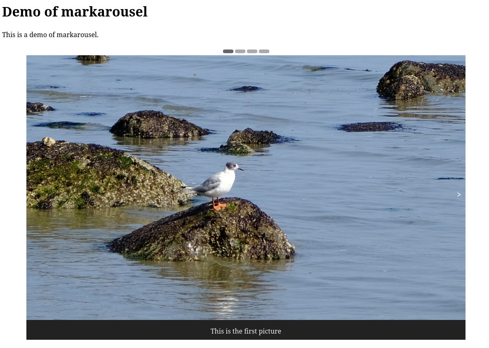

Markarousel is a drop-in plugin that creates a simple image carousel on an HTML page generated using Markdown.



# Usage

In your markdown, create a non-numbered list of pictures somewhere. The alt-text will be used as legend.

```md
- 
- 
```

_Note: All elements in the list must be images, or else Markarousel will leave them alone._

Then include markarousel at the bottom of the page: `<script src="https://raw.githubusercontent.com/cfe84/markarousel/main/markarousel.js"></script><script>markarousel()</script>`

And finally, generate HTML from markdown. When loading it, markarousel will replace your image lists by a carousel. (You can have multiple carousels per page).

You can pass a number of parameters in an options object to markarousel to customize its look and feel. Have a look at the `.js` to find out what they are.

# Why

I'm occasionally writing blog posts of my outdoor adventures, and usually I need to keep the number of images low to keep the flow of text. A carousel is so much better, because it doesn't restrict the number of pictures as much.
